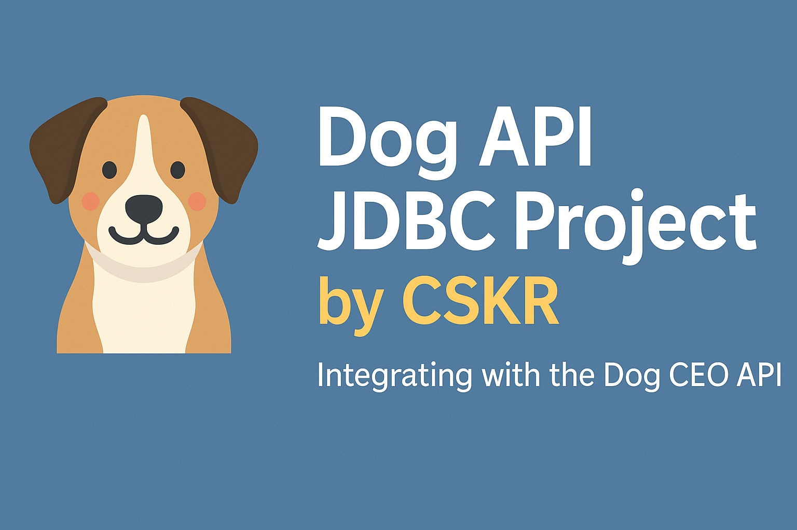

<p align="center">
  
</p>

# 🐕 Dog API JDBC Project  🐾  

A full-fledged **Java + MySQL project** that integrates with the **Dog CEO API** to fetch, store, and display **dog breeds, sub-breeds, and images** using **JDBC**, **Gson**, and a **layered architecture**.  

📚 This project demonstrates **API integration**, **database operations**, and **clean architecture design**.  

---

## 📘 Project Overview

This project integrates the **Dog CEO Public API** with a **MySQL database** using **Java JDBC**.  
It allows users to:

- 🐶 **Fetch** live dog breed, sub-breed, and image data from the Dog API.  
- 💾 **Store** all fetched data into a relational **MySQL database**.  
- 📊 **Retrieve, display, and filter** the stored data via an interactive **command-line menu**.

This project demonstrates a complete **end-to-end data flow** between the API and database:

### API → Service → DAO → Database → Menu  

---


## 🚀 Tech Stack

| Layer | Technology Used |
|--------|----------------|
| 💻 **Language** | Java 19+ |
| 🧩 **API Source** | [Dog CEO API](https://dog.ceo/dog-api/) |
| 🗄️ **Database** | MySQL |
| 🔗 **JDBC Driver** | MySQL Connector/J |
| 🧠 **JSON Parser** | Gson, org.json |
| ⚙️ **Build Tool** | Maven |
| 🧰 **IDE** | IntelliJ IDEA / Eclipse |

---

## 📁 Project Structure  

com.learn.DOG_API_PROJECT_JDBC  
│  
├── 📂 DataBase_Connection  
│   └── Db_Connection.java  
│  
├── 📂 MODEL  
│   ├── Breeds.java  
│   ├── sub_breed.java  
│   └── Image.java  
│  
├── 📂 DAO  
│   ├── Dog_DAO.java  
│   ├── Breed_DAO.java  
│   ├── Sub_breed_DAO.java  
│   ├── Sub_breed_DAO_implementation.java  
│   ├── Images_DAO.java  
│   └── Images_DAO_Implementation.java  
│  
├── 📂 Service  
│   ├── Breed_Service.java  
│   ├── Sub_breed_Service.java  
│   └── Images_Service.java  
│  
├── 📂 Dog_api  
│   ├── DogResponse.java  
│   ├── List_all_breeds.java  
│   ├── List_All_Sub_Breeds.java  
│   ├── Show_all_images.java  
│   ├── Show_one_random_image_of_breed.java  
│   └── Show_Random_image.java  
│  
├── 📂 Menu  
│   ├── API_Operations.java  
│   ├── API_Data_to_Database.java  
│   └── DB_Data.java  
│  
└── Main.java  

## 🧩 Database Setup  

### 1️⃣ Create Database  
```sql
CREATE DATABASE dog_api_db;
USE dog_api_db;
```
2️⃣ Create Tables
### Table 1: breeds
```
CREATE TABLE breeds (
    breed_id INT AUTO_INCREMENT PRIMARY KEY,
    breed_name VARCHAR(100) NOT NULL
);
```
### Table 2: sub_breeds
```

CREATE TABLE sub_breeds (
    sub_breed_id INT AUTO_INCREMENT PRIMARY KEY,
    breed_id INT NOT NULL,
    sub_breed_name VARCHAR(100) NOT NULL,
    FOREIGN KEY (breed_id) REFERENCES breeds(breed_id)
);
```
### Table 3: images
```

CREATE TABLE images (
    image_id INT AUTO_INCREMENT PRIMARY KEY,
    breed_id INT,
    sub_breed_id INT NULL,
    image_url VARCHAR(255),
    FOREIGN KEY (breed_id) REFERENCES breeds(breed_id),
    FOREIGN KEY (sub_breed_id) REFERENCES sub_breeds(sub_breed_id)
);


````

## ⚙️ Configuration  

### 🗂️ db.properties  
```properties
db_user = <your_user_name>
db_password = <your_password>
db_url = jdbc:mysql://127.0.0.1:3306/<your_data_base_name>

```


## 🧩 Architecture Overview

This project follows a **clean multi-layer architecture** that ensures modularity and separation of concerns:

### Dog API → API Layer → Service Layer → DAO Layer → MySQL Database → Menu

### 🏗️ Layer Responsibilities

| Layer | Description |
|--------|-------------|
| **API Layer** | Fetches data from Dog CEO API and parses JSON responses |
| **DAO Layer** | Handles all SQL operations using JDBC |
| **Service Layer** | Acts as a bridge between DAO and Menu |
| **Menu Layer** | Provides an interactive command-line interface |
| **Database Connection** | Centralized utility for JDBC connectivity |
| **Main Class** | Entry point of the program |

---

## 🧰 Menu Navigation  

### ▶ **Main Menu**

| 🧩 **Option** | 📝 **Description** |
|---------------|--------------------|
| 1 | API Operations |
| 2 | Save API Data to Database |
| 3 | Get Data from Database |
| 4 | Exit |

---

### 🛰 **API Operations Menu**

| 🧩 **Option** | 📝 **Description** |
|---------------|--------------------|
| 1 | List all breeds from API |
| 2 | List all sub-breeds |
| 3 | List breeds with their sub-breeds |
| 4 | List all image URLs |
| 5 | Return to main menu |

---

### 💾 **Save API Data to Database**

| 🧩 **Option** | 📝 **Description** |
|---------------|--------------------|
| 1 | Save all breeds to MySQL |
| 2 | Save all sub-breeds to MySQL |
| 3 | Save all images to MySQL |
| 4 | Back to main menu |

---

### 🧮 **Database Operations Menu**

| 🧩 **Option** | 📝 **Description** |
|---------------|--------------------|
| 1 | List all breeds from DB |
| 2 | List all sub-breeds |
| 3 | List breeds with sub-breeds |
| 4 | List all images |
| 5 | List images by breed |
| 6 | List images by sub-breed |
| 7 | Back to main menu |


## 🚀 How to Run  

### 1️⃣ Clone / Create Maven Project  
Place your source files inside:  
### src/main/java/com/learn/DOG_API_PROJECT_JDBC/


---

### 2️⃣ Add Maven Dependencies  
Add the following dependencies to your `pom.xml`:

```xml
<dependencies>
    <dependency>
        <groupId>com.mysql</groupId>
        <artifactId>mysql-connector-j</artifactId>
        <version>9.4.0</version>
    </dependency>

    <dependency>
        <groupId>org.json</groupId>
        <artifactId>json</artifactId>
        <version>20240303</version>
    </dependency>

    <dependency>
        <groupId>com.google.code.gson</groupId>
        <artifactId>gson</artifactId>
        <version>2.13.2</version>
    </dependency>
</dependencies>
```

### 3️⃣ Configure Database

Update your MySQL credentials in src/main/resources/db.properties:
```
db_user = <your_user_name>
db_password = <your_password>
db_url = jdbc:mysql://127.0.0.1:3306/<your_data_base_name>

```
### 4️⃣ Run the Project

Run the Main.java file from your IDE or terminal.

Use the interactive CLI Menu to:

Fetch data from the Dog CEO API 🐶

Store it into MySQL 💾

Retrieve and view data 🔍
